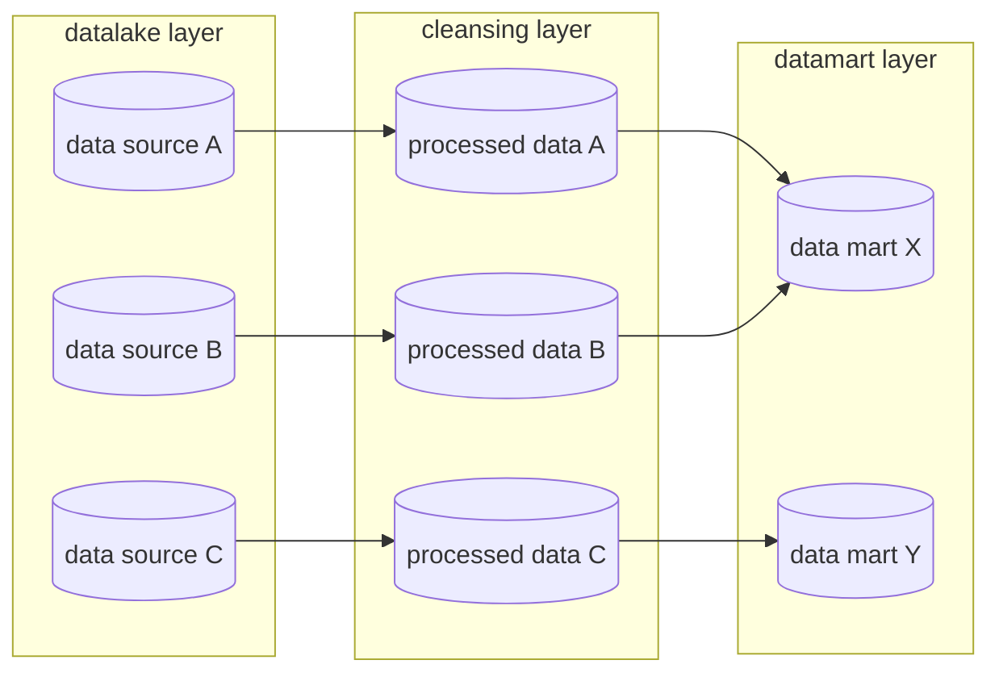

# CATE

## command

uvのセットアップ

```bash
curl -LsSf https://astral.sh/uv/install.sh | sh
source ~/.local/bin/env
uv sync --all-extras --dev
source .venv/bin/activate
ipython kernel install --user --name=cate
```

リモートに存在しないブランチを削除

```bash
git fetch --prune && git branch -vv | grep ': gone]' | awk '{print $1}' | xargs -r git branch -d
```

coverage reportの更新

```bash
pytest --cov=cate --cov-report=xml:docs/coverage/coverage.xml
```

## data processing flow

|   layer   |    directory     | description                                                                                                                                          |
| :-------: | :--------------: | :--------------------------------------------------------------------------------------------------------------------------------------------------- |
| datalake  |   `data/lake`    | 整備されていない生データを配置する.                                                                                                                  |
| cleansing | `data/processed` | 生データから必要な情報を落とさずにクレンジング（欠損補完や異常値処理など）した前処理済みデータを配置する。                                           |
| datamart  |   `data/mart`    | クレンジング層のデータに対して集約や結合、カラムの追加などを行い、分析に利用する形に整形したデータを配置する。重要な集計ロジックはここに集約させる。 |



## commit

[gitmoji.dev](https://gitmoji.dev/)

|         Emoji         | code                    | Mean                                    |
| :-------------------: | :---------------------- | :-------------------------------------- |
|      :sparkles:       | `:sparkles:`            | Introduce new features.                 |
|         :bug:         | `:bug:`                 | Fix a bug.                              |
|        :books:        | `:books:`               | Add or update documentation.            |
|         :art:         | `:art:`                 | Improve structure / format of the code. |
|       :recycle:       | `:recycle:`             | Refactor code.                          |
|         :zap:         | `:zap:`                 | Improve performance                     |
|  :white_check_mark:   | `:white_check_mark:`    | Add, update, or pass tests.             |
| :construction_worker: | `:construction_worker:` | Add or update CI build system.          |
|       :wrench:        | `:wrench:`              | Add or update configuration files.      |
|   :heavy_plus_sign:   | `:heavy_plus_sign:`     | Add a dependency.                       |
